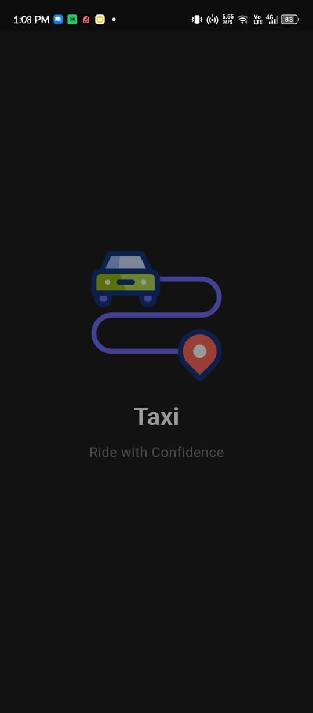
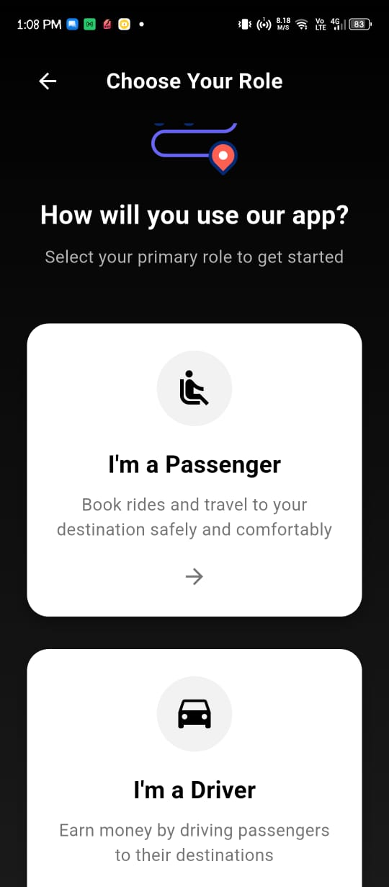
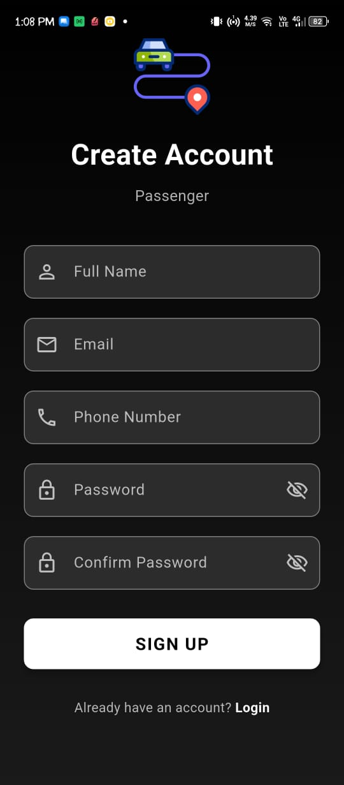
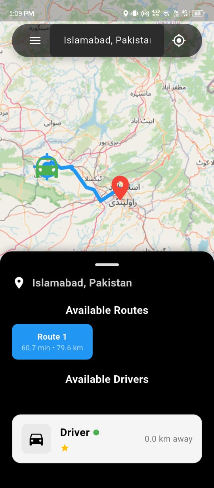
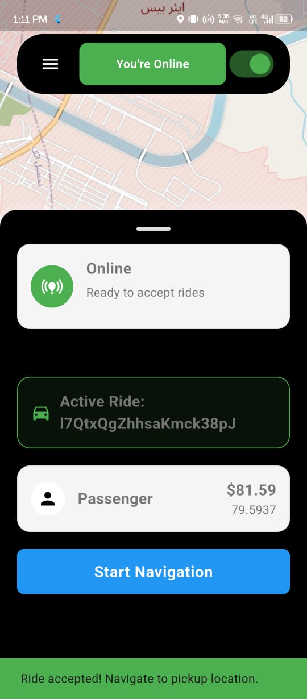

---

# 🚖 Cab_Booking\_App

[](https://flutter.dev)
[](https://dart.dev)
[](https://firebase.google.com/)
[](LICENSE)

**Taxi\_App** is a modern ride-hailing application built with **Flutter**.
It demonstrates **role-based authentication (Passenger & Driver)**, clean architecture, Firebase integration, and real-time location services.

---

## 🌟 Features

* **Role-based Authentication**: Sign up as Passenger or Driver.
* **Clean Navigation**: Centralized route management with arguments.
* **Reusable Components**: Shared widgets, validators, and theme.
* **Passenger Flow** (planned): Request rides, view ride history.
* **Driver Flow** (planned): Accept rides, manage trips, track earnings.
* **Location Service** (planned): Get user location using `geolocator`.
* **Push Notifications** (planned): Ride updates via Firebase Cloud Messaging.

---

## 🛠 How It Works

1. **User Flow**:

   * Open app → Choose role (Passenger/Driver) → Sign up → Login → Navigate to dashboard.

2. **Passenger Flow**:

   * Book rides, view ongoing rides, ride history.

3. **Driver Flow**:

   * Accept ride requests, track trips, see daily earnings.

---

## 🔗 Architecture

```
+-------------------+         +--------------------+
|   Taxi_App        |  Auth   | Firebase Backend   |
|   (Flutter App)   +-------->+ (Auth, Firestore)  |
|                   |         |                    |
+-------------------+         +--------------------+
         |
         | Location API
         v
   Geolocator Plugin
```

---

## 📸 Screenshots / GIFs (To Add)

| Feature              | Demo                                           |
| -------------------- | ---------------------------------------------- |
| Splash               |        |
| Role Choice          |          |
| Login & Signup       |         |
| Passenger Home       |  |
| Driver Home          |        |

---

## ⚡ Installation

1. Clone the repository:

```bash
git clone https://github.com/your-username/Taxi_App.git
```

2. Navigate to the project folder:

```bash
cd Taxi_App
```

3. Install dependencies:

```bash
flutter pub get
```

4. Set up Firebase project (Auth + Firestore).

5. Run the app:

```bash
flutter run
```

---

## 🛠 Technologies Used

* Flutter
* Dart
* Firebase (Auth, Firestore, FCM)
* Geolocator (Location services)

---

## 📄 License

This project is licensed under the **MIT License**.

---


